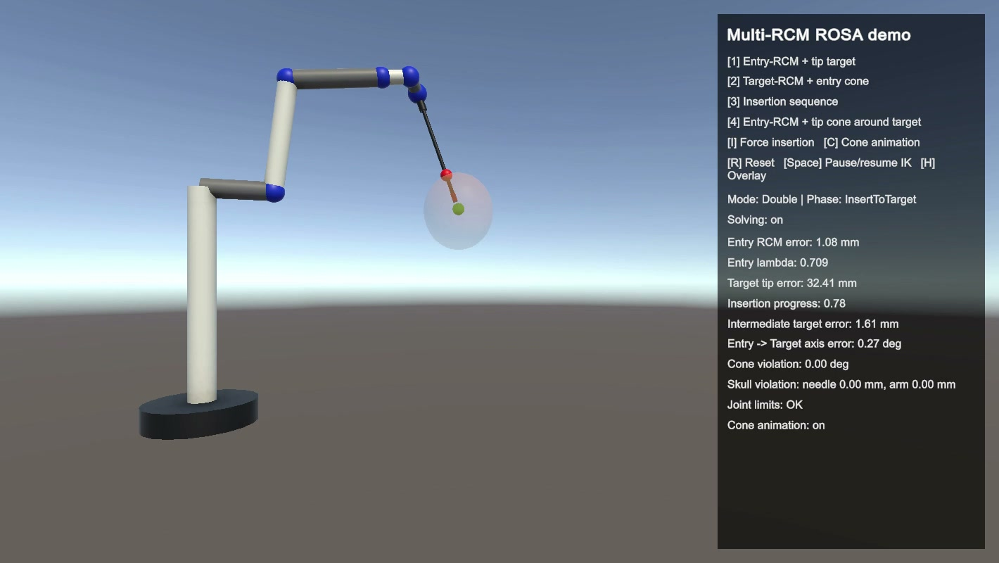

# Multi-RCM Kinematic Control for a ROSA-Like Surgical Robot


A Unity/C# simulation of a **6-DOF ROSA-like neurosurgical manipulator** performing constrained motion through one or two Remote Centers of Motion (RCMs).

The project implements a numerical kinematic controller capable of combining:

- entry-point RCM constraints;
- deep-target constraints;
- tool-tip positioning;
- cone-constrained motion;
- insertion trajectories;
- null-space joint-limit objectives.

<p align="center">
  
</p>

---

## Why Remote Center of Motion?

In minimally invasive robotic procedures, a surgical tool often passes through a constrained anatomical entry point.

The robot should therefore move the instrument while keeping its shaft approximately pivoted around that point.

For a tool with base point $$\(p_b\)$$, axis $$\(z_t\)$$, length $$\(L\)$$, and penetration parameter $$\(\lambda\)$$, the RCM point is modeled as

$$p_{RCM}(q,\lambda) = p_b(q) + \lambda L z_t(q)$$

where both the robot configuration $$\(q\)$$ and penetration $$\(\lambda\)$$ can be controlled.

This transforms the RCM constraint into an extended kinematic task.

---

## Controller Architecture

```text
Robot joint configuration q
          │
          ▼
 Forward kinematics
          │
          ├──────────────┐
          ▼              ▼
     Tool pose       RCM geometry
          │              │
          └──────┬───────┘
                 ▼
          Task construction
                 │
       ┌─────────┴─────────┐
       ▼                   ▼
 Primary surgical      Secondary /
     constraints       null-space goals
       │                   │
       └─────────┬─────────┘
                 ▼
       Numerical Jacobians
                 │
                 ▼
       Damped Least Squares
                 │
                 ▼
          qdot and λdot
                 │
                 ▼
          Robot integration
```

---

## Extended Kinematic Control

The controller solves for both joint velocity and penetration velocity:

$$\dot{x}_{ext}=J_{ext}\begin{bmatrix}\dot{q}\\\dot{\lambda}\end{bmatrix}$$

A damped least-squares inverse is used:

$$
J^{\dagger} =J^T\left(JJ^T+\mu^2I\right)^{-1}$$

which improves numerical robustness near singular configurations.

The resulting command has the general structure

$$\dot{q}=J^\{\dagger}\dot{x}_d+\left(I-J^{\dagger}J\right)\dot{q}_0$$

where the null-space component can be used for secondary objectives such as avoiding joint limits or regulating penetration.

---

## Implemented Surgical Tasks

### 1. Entry RCM + Tip Target

The instrument is constrained around the cranial entry point while the tip is driven toward the surgical target.

### 2. Target RCM + Entry-Side Cone

The target acts as the deeper pivot while the external part of the instrument is constrained within an admissible cone.

### 3. Safe Insertion Sequence

The robot performs a controlled insertion while maintaining the relevant RCM geometry.

The penetration variable is explicitly included in the optimization instead of being treated as a fixed geometric parameter.

### 4. Entry RCM + Tip Cone Around Target

The entry pivot is strongly preserved while the tip is allowed to explore a cone-shaped region around the target.

---

## Numerical Robustness

The controller contains several safeguards required by iterative inverse kinematics:

- numerical Jacobian computation;
- damped pseudoinverse;
- joint-velocity saturation;
- integration substeps;
- singularity checks;
- configurable task priorities;
- null-space joint-limit avoidance;
- penetration regulation.

The implementation therefore goes beyond a direct pseudoinverse IK controller and explicitly handles competing surgical constraints.

---

## Runtime Modes

The main controller supports multiple operating modes:

```text
EntryRCM_TipTarget
TargetRCM_EntryCone
InsertionSequence
EntryRCM_TipConeAroundTarget
Hold
```

This makes the same robot model reusable for different stages of the simulated intervention.

---

## Running the Simulation

Clone the repository and open

```text
medical_robotics/
```

as a Unity project.

Use the Unity editor version specified in:

```text
ProjectSettings/ProjectVersion.txt
```

Then open the main scene and press **Play**.

The procedural scene/controller scripts configure the robot, RCM points, target geometry and runtime task.

---

## Main Implementation

The core control logic is contained in:

```text
ROSADoubleRCMController.cs
```

which implements:

- forward kinematics;
- numerical Jacobians;
- RCM constraints;
- DLS inverse kinematics;
- task switching;
- singularity handling;
- null-space objectives;
- joint and penetration integration.

---

## Scope and Limitations

This is an **academic kinematic simulation**, not a clinical robot model.

In particular:

- the robot is ROSA-like rather than an exact commercial CAD model;
- the DH parameters are simplified;
- the controller is kinematic rather than dynamic;
- no tissue mechanics are modeled;
- no force control is implemented;
- no clinical collision-detection system is modeled.

The purpose is to study and implement the **geometry and control principles behind multi-RCM surgical robotics**.

---

## What This Project Demonstrates

- Medical Robotics
- Surgical Robotics
- Remote Center of Motion
- Forward and Inverse Kinematics
- Numerical Jacobians
- Damped Least Squares
- Task-Priority Control
- Null-Space Optimization
- Singularity Handling
- Unity Robotics
- C# Control Software

---

## Key Takeaway

The project demonstrates how multiple geometric constraints can be embedded into a unified inverse-kinematics controller for a surgical manipulator.

By treating RCM penetration as an additional optimization variable and combining DLS inversion, task priorities and null-space objectives, the controller can execute several constrained neurosurgical motion patterns using the same kinematic framework.
